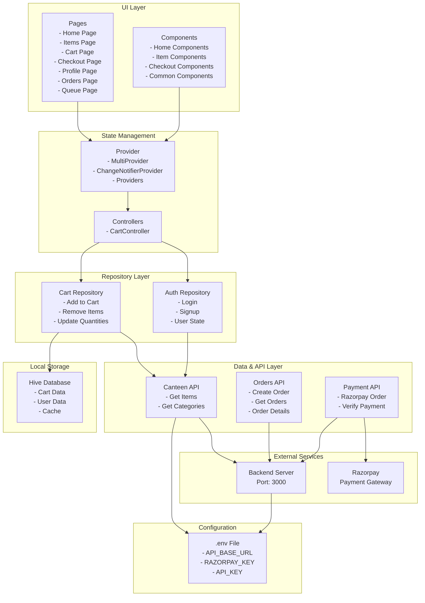

# SeeFood Mobile

A modern Flutter mobile application for food ordering and delivery management. SeeFood allows users to browse food items from a canteen, manage their shopping cart, and make secure payments through Razorpay integration.

## Table of Contents

- [Features](#features)
- [Project Structure](#project-structure)
- [Prerequisites](#prerequisites)
- [Installation](#installation)
- [Configuration](#configuration)
- [Running the Application](#running-the-application)
- [Testing](#testing)
- [Build and Deployment](#build-and-deployment)
- [Technologies and Dependencies](#technologies-and-dependencies)
- [Project Architecture](#project-architecture)
- [Environment Setup](#environment-setup)
- [Troubleshooting](#troubleshooting)

## Features

- User Authentication (Sign up and Login)
- Browse and Search Food Items
- Shopping Cart Management with Local Storage
- Real-time Cart Updates using Provider State Management
- Secure Payment Processing via Razorpay
- Order Tracking and History
- User Profile Management
- Queue Management
- Cross-platform Support (Android, iOS, Web, Windows, macOS, Linux)
- Offline Capability with Hive Local Storage

## Project Structure

```
lib/
├── main.dart                 # Application entry point
├── app.dart                  # Root widget and provider setup
├── pages/                    # UI screens
│   ├── init_page.dart       # Initialization/splash screen
│   ├── login_page.dart      # User authentication
│   ├── signup_page.dart     # User registration
│   ├── home_page.dart       # Main feed/home screen
│   ├── items_page.dart      # Food items listing
│   ├── item_page.dart       # Item details page
│   ├── cart_page.dart       # Shopping cart
│   ├── checkout_page.dart   # Order confirmation
│   ├── orders_page.dart     # Order history
│   ├── profile_page.dart    # User profile
│   ├── queue_page.dart      # Queue management
│   └── main_page.dart       # Main navigation
├── components/              # Reusable UI components
│   ├── homePage/           # Home page components
│   ├── itemPage/           # Item page components
│   ├── checkoutPage/       # Checkout components
│   ├── initPage/           # Init page components
│   └── common/             # Common/shared components
├── store/                   # State management
│   ├── auth/               # Authentication logic
│   │   └── auth_repository.dart
│   └── cart/               # Cart management
│       ├── cart_controller.dart
│       ├── cart_repository.dart
│       └── hive_init.dart
├── data/                    # Data access and API calls
│   ├── app_env.dart        # Environment configuration
│   └── canteen_api/        # API endpoints
├── orders/                  # Order management
│   ├── order_models.dart
│   └── orders_api.dart
├── payment/                 # Payment processing
│   ├── razorpay_service.dart
│   ├── razorpay_order_api.dart
│   ├── order_api.dart
│   └── order_verify_api.dart
└── themes/                  # UI theming
    ├── app_colors.dart
    └── app_theme.dart

integration_test/           # Flutter integration tests
├── auth_test.dart

e2e/                       # End-to-end tests using Playwright
├── tests/
│   ├── auth.spec.ts
│   ├── cart.spec.ts
│   ├── checkout.spec.ts
│   ├── navigation.spec.ts
│   ├── profile_orders.spec.ts
│   └── shop.spec.ts
└── playwright.config.ts

android/                   # Android platform code
ios/                      # iOS platform code
web/                      # Web platform code
windows/                  # Windows platform code
linux/                    # Linux platform code
macos/                    # macOS platform code
```

## Prerequisites

- Flutter SDK 3.10.4 or higher
- Dart SDK 3.10.4 or higher
- Android Studio or Xcode (for mobile development)
- A connected device or emulator
- Git for version control
- Node.js (for E2E testing setup)

## Installation

### 1. Clone the Repository

```bash
git clone <repository-url>
cd seeFood_Mobile
```

### 2. Install Flutter Dependencies

```bash
flutter pub get
```

### 3. Generate Code (if needed)

Some packages may require code generation:

```bash
flutter pub run build_runner build
```

## Configuration

### Environment Setup

Create a `.env` file in the project root directory:

```env
API_BASE_URL=http://your-api-url:3000
API_KEY=your_api_key
RAZORPAY_KEY=your_razorpay_key
```

Replace the placeholder values with your actual configuration:
- **API_BASE_URL**: Your backend API server URL
- **API_KEY**: API authentication key
- **RAZORPAY_KEY**: Razorpay merchant key for payment processing

The application loads these variables using `flutter_dotenv` on startup.

### Hive Storage

The application uses Hive for local data persistence. Storage is automatically initialized in `main.dart` before running the app.

## Running the Application

### Run on Emulator/Device

```bash
flutter run
```

### Run in Release Mode

```bash
flutter run --release
```

### Run on Specific Device

List available devices:
```bash
flutter devices
```

Run on specific device:
```bash
flutter run -d <device-id>
```

### Run on Web

```bash
flutter run -d chrome
# or
flutter run -d web-server
```

### Android Setup

Launch emulator:
```bash
flutter emulators --launch Medium_Phone_API_36.1
```

Forward localhost port (required for backend communication):
```bash
adb reverse tcp:3000 tcp:3000
```

### iOS Setup

```bash
flutter run
```

Make sure you have Xcode installed and configured properly.

## Testing

### Flutter Integration Tests

Run all integration tests:

```bash
flutter test integration_test/
```

Run specific integration test:

```bash
flutter test integration_test/auth_test.dart
```

### E2E Tests with Playwright

The project includes comprehensive end-to-end tests using Playwright:

```bash
cd e2e

# Install dependencies
npm install

# Run all tests
npx playwright test

# Run specific test file
npx playwright test tests/auth.spec.ts

# Run tests in debug mode
npx playwright test --debug

# Run tests with UI mode
npx playwright test --ui
```

Available E2E test suites:
- **auth.spec.ts** - Authentication flows
- **shop.spec.ts** - Shopping and item browsing
- **cart.spec.ts** - Cart operations
- **checkout.spec.ts** - Checkout process
- **profile_orders.spec.ts** - User profile and order history
- **navigation.spec.ts** - App navigation flows

## Build and Deployment

### Android Build

Debug APK:
```bash
flutter build apk --debug
```

Release APK:
```bash
flutter build apk --release
```

App Bundle (for Play Store):
```bash
flutter build appbundle --release
```

### iOS Build

```bash
flutter build ios --release
```

### Web Build

```bash
flutter build web --release
```

### Other Platforms

Windows:
```bash
flutter build windows --release
```

macOS:
```bash
flutter build macos --release
```

Linux:
```bash
flutter build linux --release
```

## Technologies and Dependencies

### Core Dependencies

- **flutter** - Flutter SDK framework
- **provider** (6.1.2) - State management solution
- **http** (1.6.0) - HTTP client for API requests
- **flutter_dotenv** (6.0.0) - Environment variable management
- **hive** (2.2.3) - Local data storage
- **hive_flutter** (1.1.0) - Flutter support for Hive
- **razorpay_flutter** (1.3.7) - Razorpay payment integration
- **cupertino_icons** (1.0.8) - iOS-style icons
- **url_launcher** (6.3.0) - Open URLs
- **app_links** (6.1.4) - Deep linking support

### Dev Dependencies

- **flutter_test** - Flutter testing framework
- **integration_test** - Flutter integration testing
- **flutter_lints** (6.0.0) - Lint rules

### E2E Testing

- **Playwright** - Browser automation for E2E tests
- **Node.js** - JavaScript runtime

## Project Architecture

### Application Layers Architecture



### State Management with Provider

The application uses Provider for centralized state management:

1. **CartRepository** - Manages shopping cart data with Hive persistence
2. **CartController** - Provides cart state notifications to UI
3. **AuthRepository** - Handles user authentication state

Providers are initialized in `app.dart` and accessible throughout the widget tree.

### API Communication

API calls are organized by feature:
- `data/canteen_api/` - Canteen/item operations
- `orders/orders_api.dart` - Order management
- `payment/razorpay_order_api.dart` - Order creation for payment
- `payment/order_verify_api.dart` - Payment verification

### Data Persistence

- **Hive** - Local storage for cart and user data
- **Automatic Sync** - Provider automatically syncs local and remote state

### Navigation

The app uses Flutter's Material navigation:
- InitPage - Entry point with authentication check
- MainPage - Bottom tab navigation
- Individual feature pages for specific flows

## Environment Setup

### For Macintosh Users

If you're developing on macOS, you can use the provided command to reverse port for Android testing:

```bash
~/Library/Android/sdk/platform-tools/adb reverse tcp:3000 tcp:3000
```

### Code Analysis

Run Flutter analyzer:
```bash
flutter analyze
```

View analysis options in `analysis_options.yaml`.

## Troubleshooting

### Build Issues

**Issue**: Dependencies not found
```bash
flutter clean
flutter pub get
```

**Issue**: Gradle issues on Android
```bash
cd android
./gradlew clean
cd ..
flutter run
```

### Runtime Issues

**Issue**: Cannot connect to API
- Check that `API_BASE_URL` in `.env` is correct
- Ensure backend server is running
- For Android emulator: Run `adb reverse tcp:3000 tcp:3000`

**Issue**: Hive database errors
- Clear app data and reinstall
- Delete Hive box files from device storage

**Issue**: Razorpay payment fails
- Verify `RAZORPAY_KEY` in `.env`
- Check internet connectivity
- Ensure Razorpay account is active

### Development Tips

- Use `flutter pub upgrade` to update dependencies
- Check `pubspec.yaml` for version constraints
- Review `devtools_options.yaml` for debugging configuration
- Run `flutter doctor` to verify development environment

## Contributing

When contributing to this project:

1. Create a feature branch
2. Follow existing code structure and naming conventions
3. Add integration tests for new features
4. Update E2E tests for user-facing changes
5. Ensure all tests pass before submitting PR

## License

[Add your license information here]

## Support

For issues or questions, please open an issue on the repository or contact the development team.
